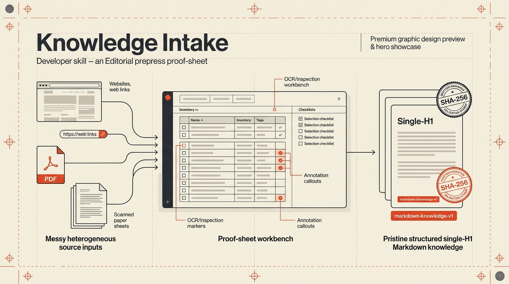
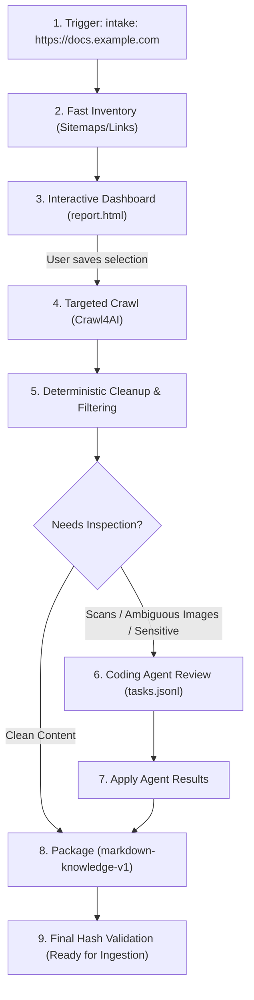

# 📦 Knowledge Intake

[](https://www.python.org/downloads/)
[](https://github.com/astral-sh/uv)
[](https://github.com/unclecode/crawl4ai)
[](#package-output-contract)
[](#key-highlights)

> **Turn messy websites, HTML, PDFs, scans, and documents into clean, traceable, reviewable Markdown packages ready for Knowledge Bases and RAG retrieval.**



Knowledge Intake is a portable, deterministic, and interactive intake pipeline designed for coding agents and human reviewers. It replaces unguided web scrapers and heavyweight local LLM extractors with a fast **Inventory-First** workflow, a **live proof-sheet dashboard** with OS-grade bulk selection, and targeted extraction.

---

## 🌟 Key Highlights

- ⚡ **Inventory First**: Instantly discovers sitemaps and links in seconds without rendering or downloading full pages upfront.
- 🎨 **Live Proof-Sheet Dashboard**: A physical prepress proof-sheet UI with collapsible category accordions, instant live search (<kbd>/</kbd>), filter chips, and OS-style marquee drag-selection.
- 🎯 **Collect Only What Matters**: Crawl4AI renders and extracts *only* your chosen sections, ignoring hundreds of media/upload/utility files.
- 🧹 **Deterministic Cleanup Pipeline**: Multi-pass boilerplate removal strips navigation menus, repeated site slogans, bylines, contact cards, promo banners, and marketing footers.
- 🤖 **Agentic Review Queue (Zero Local LLM)**: Visual interpretations, scanned PDFs, and sensitive domain claims route to the active coding agent for review instead of spinning up costly local models.
- 📦 **Structured Knowledge Packages**: Produces standardized, single-H1 UTF-8 Markdown articles with cryptographic SHA-256 manifests and package declarations conforming to `markdown-knowledge-v1`.

---

## 🔄 The Intake Workflow



---

## 🚀 Quick Start (Standalone)

### 1. Setup

```powershell
# Clone the canonical repository
git clone https://github.com/shaiadams10/SA-Knowledge-Intake.git
cd SA-Knowledge-Intake

# Sync virtualenv and verify runtime
uv sync
uv run python scripts/intake.py doctor
```

*(If Crawl4AI browser binaries are missing, run `uv run crawl4ai-setup`)*

### 2. Run Intake on a Source

```powershell
# Step 1: Inventory the site (takes seconds)
uv run python scripts/intake.py start https://docs.example.com

# Step 2: Open the interactive dashboard
uv run python scripts/intake.py serve docs-example-com --open
```

1. Select the relevant categories or individual pages in the dashboard.
2. Click **Save selection**.
3. Return to your terminal and collect:

```powershell
# Step 3: Crawl and clean only selected pages
uv run python scripts/intake.py collect docs-example-com

# Step 4: Package & validate
uv run python scripts/intake.py package docs-example-com
uv run python scripts/intake.py validate docs-example-com
```

Your validated Markdown package is now ready in `.knowledge-intake/runs/docs-example-com/package/`!

---

## 🤖 Installing into Any Coding Agent

Knowledge Intake is packaged as a **portable agent skill** compatible with Google Antigravity, OpenAI Codex, Anthropic Claude Code, Cursor, Windsurf, Cline, and GitHub Copilot.

### Installation Command

Run the installer pointing to your target project:

```powershell
# Install into the current project (.agents/skills/knowledge-intake)
python scripts/install_skill.py .

# Or install globally to user skills (~/.codex/skills or ~/.gemini/antigravity/skills)
python scripts/install_skill.py --global
```

---

### 📋 Ready-to-Use Prompts for Your Coding Agent

#### 📥 Prompt 1: Install Skill into Current Project
Copy and paste this prompt to your coding agent:

```text
Please install the Knowledge Intake skill into the current project from its canonical repository:
https://github.com/shaiadams10/SA-Knowledge-Intake

Clone or download the repository into a temporary directory, run its `scripts/install_skill.py` with the current project root as the target, and then remove the temporary checkout. Finally, run `uv run python .agents/skills/knowledge-intake/scripts/intake.py doctor` from the project root to verify the installation and confirm that the skill is available for intake commands.
```

#### 🔄 Prompt 2: Update Skill to Latest Version
Copy and paste this prompt to check and update your installed skill:

```text
Please check whether the Knowledge Intake skill installed in this project is up to date with its canonical repository:
https://github.com/shaiadams10/SA-Knowledge-Intake

Clone or download the latest repository into a temporary directory. Run its `scripts/install_skill.py --check` with the current project root as the target. If updates are available, run the same installer without `--check`. Remove the temporary checkout, then run `uv run python -m unittest discover -s .agents/skills/knowledge-intake/tests -v` from the project root to confirm the installation.
```

#### 🎯 Prompt 3: Trigger Knowledge Intake
To start processing a source, simply tell your agent:

```text
intake: https://docs.example.com
```
*or for local documents:*
```text
intake: ./documents/ProductManual.pdf
```

---

## 🖥️ Interactive Dashboard Features

The dashboard serves a local, zero-remote-dependency prepress proof sheet adhering to [DESIGN.md](DESIGN.md):

| Feature | Description |
| :--- | :--- |
| **Instant Search (<kbd>/</kbd>)** | Real-time filtering across titles, URLs, and category paths with automatic group expansion. |
| **Filter Tabs** | Instant pills for **All**, **Recommended**, **Noise**, **Selected**, and **Unselected**. |
| **Collapsible Accordions** | Categories start neatly collapsed with live count ratio badges (`14 / 28 selected`). |
| **Click-Anywhere Selection** | Click anywhere on a row to instantly select/deselect it. |
| **Marquee Drag-Select** | Click and drag a rectangular bounding box across rows to bulk-select multiple items. |
| **Shift + Click Range** | Click an anchor row, hold <kbd>Shift</kbd>, and click another row to select the entire range. |
| **Full Keyboard Navigation** | <kbd>↑</kbd>/<kbd>↓</kbd> to navigate, <kbd>Shift</kbd>+<kbd>↑</kbd>/<kbd>↓</kbd> to expand range, <kbd>Space</kbd> to check, <kbd>Ctrl</kbd>+<kbd>A</kbd> to select visible. |
| **Non-Destructive Polling** | Background status updates do not overwrite your in-progress UI selections before saving. |

---

## 🛠️ CLI Command Reference

All commands run via `python scripts/intake.py <command> [args]`:

| Command | Description |
| :--- | :--- |
| `doctor [--json]` | Verifies Python environment, Crawl4AI browser, and PDF dependencies. |
| `start <SOURCE> [--name N]` | Initializes source run, runs sitemap/link inventory, and generates report. |
| `serve <NAME> [--port 8765] [--open]` | Starts local loopback HTTP dashboard for interactive review and selection. |
| `select <NAME> --include PATTERN` | Headless CLI selection using glob/URL path patterns. |
| `collect <NAME> [--max-pages N]` | Concurrently crawls and cleans selected pages via Crawl4AI. |
| `needs <NAME> [--json]` | Lists pending agent review items (scans, complex diagrams, sensitive claims). |
| `prepare-agent <NAME>` | Generates `agent/tasks.jsonl` for coding agent inspection. |
| `apply-agent <NAME>` | Merges agent's `agent/results.jsonl` back into the cleaned corpus. |
| `package <NAME>` | Compiles cleaned articles into `package/articles/*.md` with integrity manifests. |
| `validate <NAME>` | Checks cryptographic hashes, single H1 rules, and format compliance. |

---

## 📁 Package Output Contract (`markdown-knowledge-v1`)

```text
.knowledge-intake/runs/<source-name>/
  ├── run.json                  # Lifecycle status & event audit log
  ├── selection.json            # Immutable snapshot of saved URLs
  ├── inventory.jsonl           # Complete endpoint catalog with group & recommendation
  ├── report.html               # Live proof-sheet dashboard
  └── package/
      ├── package.json          # Package descriptor & metadata
      ├── manifest.jsonl        # SHA-256 integrity manifest per article
      └── articles/
          ├── knowledge-001.md
          ├── knowledge-002.md
          └── ...
```

Each generated Markdown file in `articles/`:
- Formatted in clean UTF-8.
- Starts with exactly **one top-level `# H1` heading**.
- Contains structured paragraphs, tables, and sub-headings without frontmatter, raw HTML tags, navigation chrome, or advertising.

---

## 🧪 Testing & Validation

```powershell
# Run the complete test suite
uv run python -m unittest discover -s tests -v

# Check runtime environment
uv run python scripts/intake.py doctor --json

# Validate skill metadata
python scripts/install_skill.py --check .
```

---

## 📄 License

MIT License. Designed for agentic software engineering and auditable knowledge management.
